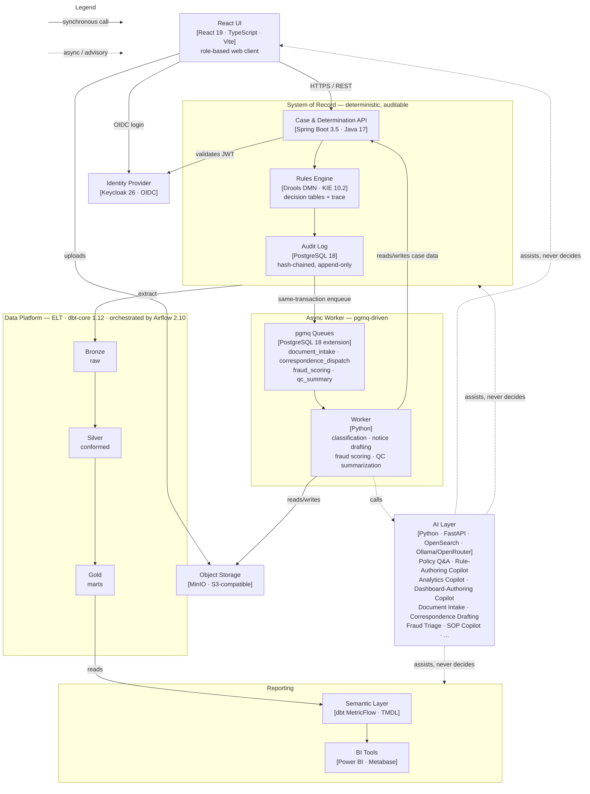
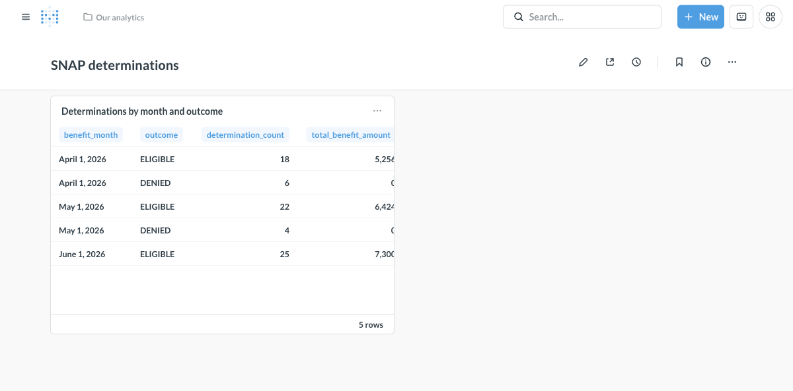
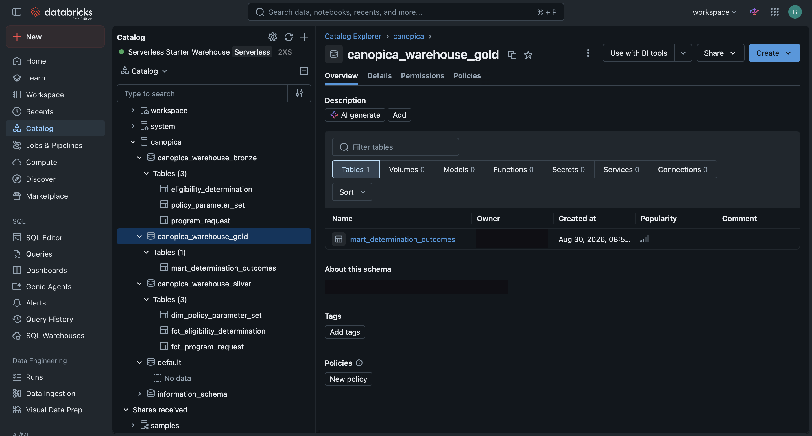
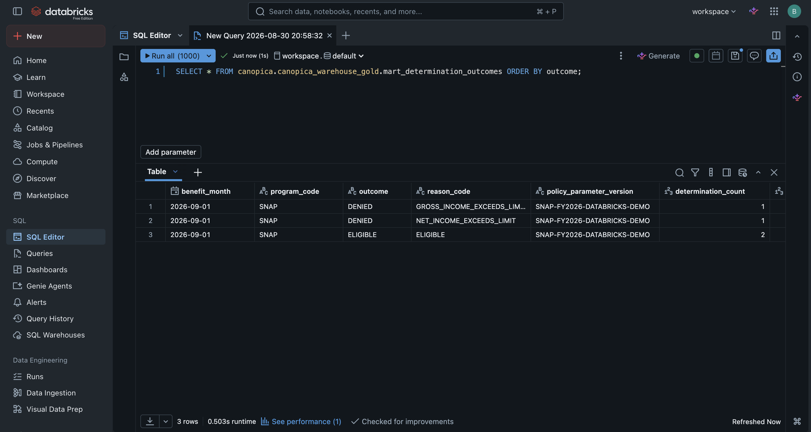
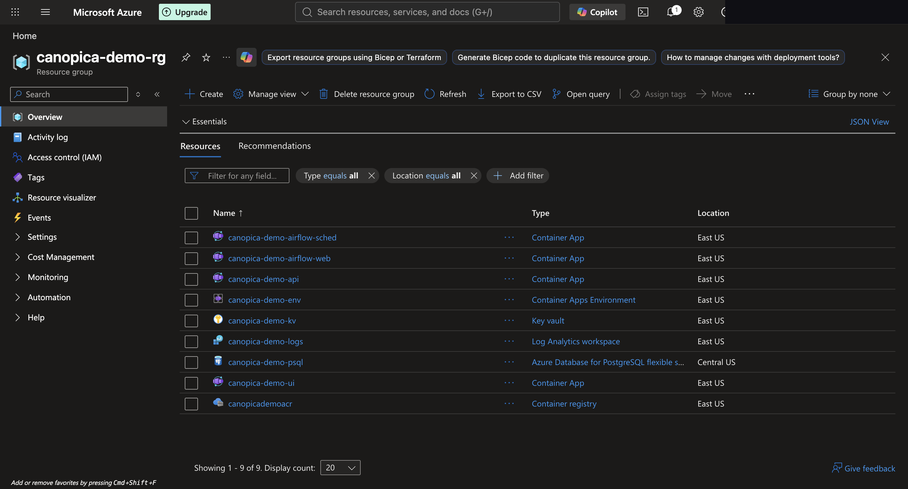
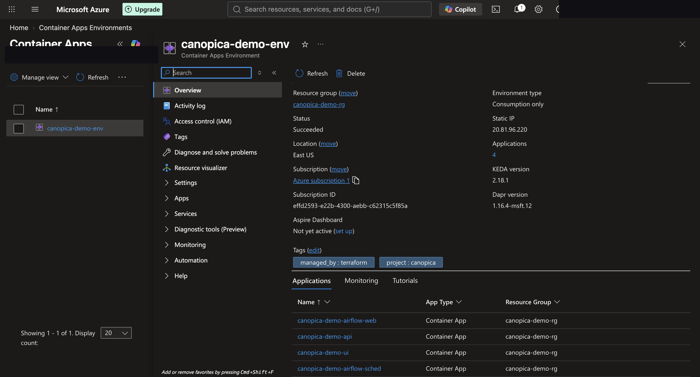
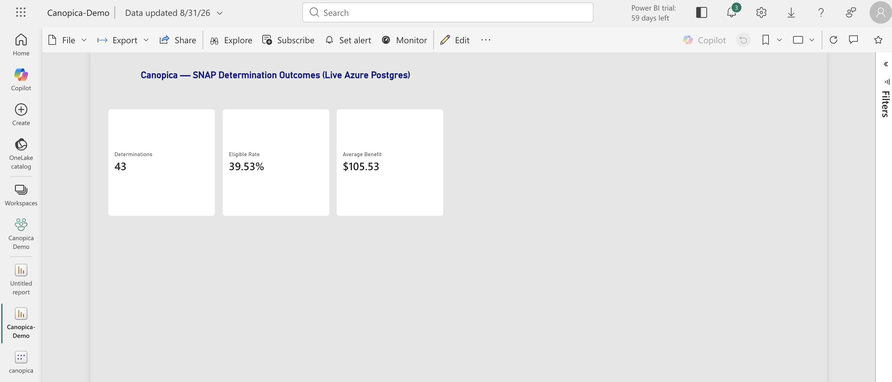

# Canopica

[](https://github.com/bsreecharanreddy/canopica/actions/workflows/ci.yml)
-86%25-brightgreen)
-78%25-yellowgreen)
-83%25-brightgreen)

## TL;DR

Canopica is a deterministic, auditable benefits-eligibility decision
system with an AI copilot layer on top — every dollar amount traces to a
DMN decision-table run and a hash-chained audit log, and every one of its
nine LLM-backed capabilities is architecturally barred from making a
binding decision itself. **Built solo, start to finish**: every design
doc, every line of the Java/Spring API, the React UI, and the Python data
platform, every CI job, and every cloud deployment below.

- **Reproducible by construction.** An old determination re-run years
  later against its own historical policy-parameter version still
  produces its original dollar amount — verified by test, not assumed.
- **AI kept on a leash, not just told to behave.** Grounded-citation
  checks, a hallucination-guard-and-abstain discipline verified against
  real live-model failures (not just written down), an eval-suite CI gate
  (RAGAS/DeepEval), and a fairness disparate-impact gate — see
  [`docs/ARCHITECTURE.md`](docs/ARCHITECTURE.md) for the concrete incident
  each of these closed.
- **Proven on real infrastructure, not just `docker compose up`.**
  Terraform actually applied to Azure Container Apps, a real Databricks
  Free Edition dbt run, and a live TMDL semantic model published to Power
  BI Service — screenshots in [Known constraints & scoping decisions](#known-constraints--scoping-decisions)
  below.

**Live demo:** [canopica-policy-demo.fly.dev](https://canopica-policy-demo.fly.dev)
— a real deployed instance of the Policy Q&A capability, not a mockup.
Kept **stopped by default** between uses to control Fly.io compute cost
(~$22/mo running continuously) — it auto-wakes on the first request but
can take up to ~3 minutes to finish booting OpenSearch + Ollama, so please
be patient on a cold start rather than assuming it's down.

Five-minute architecture read: [`docs/ARCHITECTURE.md`](docs/ARCHITECTURE.md). Full depth: [§ Docs](#docs) below.

---

A portfolio project demonstrating a deterministic, auditable decision
system — the kind where every dollar amount has to be explainable and
reproducible — with an AI capability layer built on top of that core: a
Java/Spring API + React UI, a DMN rules engine (Drools/KIE), a governed
bronze/silver/gold data platform (dbt, Airflow, Delta Lake, real cloud
deployments on Databricks and Azure), BI reporting as code, and an AI
layer built as fixed, auditable pipelines rather than an open-ended
agent. Applied to benefits eligibility as the vehicle for exercising
that architecture end to end, not as the point of the project.

> Independent project inspired by publicly documented patterns in how
> state health & human services eligibility systems generally work. Not
> affiliated with, endorsed by, or built for any government agency or
> vendor. Every applicant record in this repo is synthetic — no real
> individual's data is ever used, scraped, or stored.

## Why this exists

Most portfolio projects are a CRUD app and a README. This one is an
attempt at something closer to what an actual senior/staff engineering
hire looks like: real (public) source data instead of invented fixtures,
a rules engine instead of nested conditionals, a governed lakehouse-style
data platform instead of a raw dump into Postgres, real deployments to
two different clouds instead of Terraform nobody ever ran, and an AI
layer that is explicit and disciplined about where AI belongs in a
decision system — and where it very much doesn't.

**Built to be read by hiring managers/engineers for**: senior Data
Scientist, Forward Deployed Engineer, Data/Analytics Engineering, BI &
Reporting (Azure Synapse/Fabric-adjacent), and full-stack Java/Spring/React
roles. See [§ Who should look at what](#who-should-look-at-what) below.

## The one governing principle

**AI drafts, flags, explains, and assists. Deterministic systems — the
rules engine, scheduled pipeline jobs — and human reviewers own every
binding decision, every scheduled operation, and every dollar amount.**

This isn't a slogan. It's the direct answer to a well-documented failure
mode in automated decision systems generally: letting a model own a
binding, high-stakes decision with no human in the loop is a real,
litigated failure pattern, not a hypothetical one. Every AI feature in
this repo is scoped to stay on the "assists" side of that line — see the
design docs for how that plays out component by component.

## Architecture, at a glance



Full architecture, every component, and the reasoning behind each choice
live in `docs/design/` — this README stays high-level on purpose.

## Quickstart

Everything runs locally with Docker — no cloud account, no API keys, $0
to clone and run.

```bash
make up        # build + start postgres, api, ui, metabase
make seed      # generate + load 500 synthetic households through the real intake API
make pipeline  # ingest -> dbt build (silver/gold) -> serving materialization -> Metabase provisioning
```

Then:

| | |
|---|---|
| Web UI (role-based access) | <http://localhost:3000> |
| API health | <http://localhost:8080/actuator/health> |
| Metabase (determinations dashboard) | <http://localhost:3001> |

`make seed` only exercises the customer-facing intake path (submitting an
application) — it deliberately never runs a determination, since that's a
worker action a household doesn't take for itself. So the gold mart and
dashboard are legitimately empty right after `make pipeline` until a
determination has actually been run for at least one submitted request
(via the worker-facing `POST /api/program-requests/{id}/determinations`
endpoint, or the UI signed in as a worker) — then `make pipeline`
picks it up on its next run. `docs/demo.md` walks the full
intake-through-determination-through-dashboard path end to end.



Tear down with `make down` (also removes the Postgres volume).

## Status & roadmap

**Phase 1a is done** — the full walking skeleton (intake → rules-engine
determination → hash-chained audit trail → dbt warehouse → Metabase
dashboard) runs end to end against real infrastructure, proven by
`data-platform/tests/test_end_to_end.py` and walkable by hand in
[`docs/demo.md`](docs/demo.md). **Phase 1b (hardening) is done** —
identity, row-level authorization, mocked external verification, Airflow
orchestration, full medallion coverage, widened reporting, governance
(PII tokenization, `docs/design/compliance-mapping.md`), accessibility
(axe-clean UI pages, `jsx-a11y` lint in CI), observability
(OpenTelemetry traces in Jaeger, Prometheus/Grafana metrics), and
reference Terraform for Azure (`infra/azure/`) are all in place. **Phases
2, 3, and 4** (Policy Intelligence & Analytics AI, Case Intake &
Communication AI, and Compliance & Integrity AI) **are done. Phase 5**
(real cloud deployment demos) **is done** — the Terraform above was
actually applied against a live Azure subscription, not just validated,
and the existing dbt project and TMDL semantic model were proven against
real Databricks and Power BI Service targets; see "Known constraints &
scoping decisions" below for what each demo found and how it was
resolved.

| Phase | Focus | Status |
|---|---|---|
| 1a | Walking skeleton — intake → rules-engine determination → audit trail → warehouse → report page, end to end | Done |
| 1b | Hardening — identity, caseload-scoped authorization, external interface, orchestration, governance mapping, accessibility, observability, reference Terraform | Done |
| 2 | Policy Intelligence & Analytics AI — RAG-based policy Q&A, rule-authoring copilot, natural-language analytics | Done |
| 3 | Case Intake & Communication AI — document classification/extraction, AI-drafted correspondence, localization | Done |
| 4 | Compliance & Integrity AI — fraud risk triage, SLA/QC monitoring, caseworker SOP copilot | Done |
| 5 | Real cloud deployment demos (Databricks, Azure, Power BI/Fabric); domain expansion (TANF, Medicaid) stated as a deliberately-not-built extension point | Done |

See `docs/design/2026-08-21-full-system-and-phased-roadmap.md` for the
full breakdown of every phase, and [`docs/STATUS.md`](docs/STATUS.md) for
task-level detail.

## Known constraints & scoping decisions

Phase 1a is a real, working slice, not a demo shell, and Phase 1b —
Keycloak identity, caseload-scoped row-level authorization, the mocked
external verification interface, Airflow orchestration, full medallion
coverage, widened reporting, governance (PII tokenization), accessibility,
observability (OpenTelemetry traces in Jaeger, Prometheus/Grafana
metrics), and reference Terraform for Azure — has already closed several
of its original gaps. What's still deliberately thin is worth stating
plainly rather than leaving a reader to discover:

- **A narrow rules-engine scope.** One program modeled end to end, not
  the full breadth of real-world eligibility rules a production system
  would carry, and household size is capped at 8 — the point of this
  repo is the rules-engine/audit/pipeline architecture underneath, not
  exhaustive policy coverage (see Phase 5's scope note below).
- **Databricks now proven for real** (Phase 5 Task 1) — the existing dbt
  project runs unmodified-in-logic against a real Databricks Free Edition
  serverless SQL warehouse: `data-platform/databricks-adapter/` gives it
  an isolated `dbt-core`/`dbt-databricks` pair (the two can't share this
  project's main lockfile — every `dbt-databricks` release caps `dbt-core`
  below what the DuckDB target needs), a small seeded bronze slice proves
  the silver/gold chain end to end, and one real dialect gap
  (`SIMILAR TO` isn't valid Databricks SQL; the shared PII-guard macro now
  dispatches to `RLIKE` there) was found and fixed.

  
  

  Full-resolution originals: [`databricks-unity-catalog.png`](docs/cloud-demo/databricks-unity-catalog.png), [`databricks-sql-result.png`](docs/cloud-demo/databricks-sql-result.png).
- **Azure now proven for real too** (Phase 5 Task 2) — `infra/azure/`'s
  reference Terraform was applied for real against a live Free Trial
  subscription: resource group, Key Vault, Postgres Flexible Server,
  Log Analytics, a Container Registry, and all four Container Apps
  (`api`, `ui`, `airflow-webserver`, `airflow-scheduler`), every one
  confirmed genuinely `Running`/healthy by hitting its real public
  health endpoint, not just "created." Five real gaps the `validate`-only
  history never exercised were found and fixed live: Postgres SKU
  capacity missing in the default region, a Postgres server with no
  firewall rule at all (public access enabled ≠ reachable), an
  unlisted database extension Azure's managed Postgres gates that
  self-hosted Postgres doesn't, `ui`'s nginx config hardcoding Docker
  Compose's own service DNS name, and Airflow's metadata database never
  being initialized (no init job in this reference config). See
  [`infra/azure/README.md`](infra/azure/README.md) for what's modeled and
  what's deliberately absent (Keycloak/Metabase/the observability stack
  among them) and the `usgovcloud` swap this project can't actually
  exercise itself (§ Compliance & governance below).

  
  

  Torn down immediately after screenshots, same session — nothing from
  this apply is left running. Task 2 Step 5 attempted a Microsoft Fabric
  screenshot of the real TMDL semantic model specifically; Fabric trial
  *activation* failed with Microsoft's own documented restriction — new
  tenants are blocked from trial capacity for roughly 90 days, a
  structural limit, not a retry-able error. What the trial granted
  instead (Power BI Individual) was already documented as sufficient for
  this exact import, so the semantic model was published there instead,
  against the same live Azure Postgres data: 43 real determinations,
  39.53% eligible rate, $105.53 average benefit.

  

  Full-resolution originals: [`azure-resource-group.png`](docs/cloud-demo/azure-resource-group.png), [`azure-container-apps-environment.png`](docs/cloud-demo/azure-container-apps-environment.png), [`powerbi-service-report.png`](docs/cloud-demo/powerbi-service-report.png).

- **CI ran on a self-hosted Azure VM for six days (2026-08-25 –
  2026-08-31) during private development.** Private-repo GitHub Actions
  minutes are capped at 2000/month; once the AI layer's e2e/eval jobs
  (OpenSearch + Ollama) started running on every push, this repo
  exhausted that cap for real (run `32913936148`, a hard
  payment-required error). Self-hosting ran the identical jobs and gates
  without weakening any of them, and moved back to GitHub-hosted runners
  at this public flip, once public repos' free/unlimited Actions minutes
  apply instead. Mentioned here so several days of CI-debugging commits
  in that window read as building under a real, named constraint, not as
  struggling with a solved problem.

Every one of these is a scoping decision, not an oversight — see the plan's
own "Deferred out of Phase 1a, on purpose" list
(`docs/plans/2026-08-21-phase-1a-implementation-plan.md`) and
[`2026-08-21-tech-stack-and-production-tradeoffs.md`](docs/design/2026-08-21-tech-stack-and-production-tradeoffs.md)
for what each substitution in the stack itself costs relative to a real
production deployment.

## Test coverage

The three badges at the top are real, measured line coverage — not an
estimate — from a full `make test` run on 2026-09-01: JaCoCo for the two
Java modules, `pytest-cov` for the three Python packages, and Vitest's
`v8` provider for the UI. Wired into `pom.xml`/`vite.config.ts` and each
Python package's dev dependencies, so `./mvnw verify`, `npm run
test:coverage`, and `pytest --cov` regenerate these numbers on demand —
the badges themselves are a dated snapshot, not a live service, so they
won't drift back into sync automatically if the numbers move.

| Layer | Line coverage | Note |
|---|---|---|
| Java (`api` + `rules-engine`) | 86% | JaCoCo, combined across both modules |
| Python (`data-platform` + `ai` + `worker`) | 78% | `pytest-cov`, `-m "not e2e"`; `data-platform` alone reads lower (55%) because its CLI/pipeline entrypoints are exercised by the separate integration/e2e suite (`make e2e`), not unit tests, and this figure only covers the latter |
| UI (`ui/`) | 83% | Vitest, statement/line coverage via `@vitest/coverage-v8` |

## Tech stack

| Layer | Choice |
|---|---|
| API + UI | Spring Boot (Java) + React, role-gated customer/worker views |
| Identity | Keycloak (self-hosted OIDC) |
| Rules engine | DMN decision tables on Drools/KIE, against effective-dated policy parameters |
| Data platform | Python, dbt + DuckDB locally, real Delta Lake tables, Postgres serving layer |
| Orchestration | Airflow |
| Reporting | Power BI semantic model as code (TMDL, so it diffs in git), plus a containerized dashboard so the repo renders for anyone who clones it |
| Search / RAG | OpenSearch (hybrid lexical + vector) |
| AI runtime | Local, self-hosted (Ollama) by default — $0 to clone and run |
| Local infra | Docker Compose |
| Cloud target | **Databricks Free Edition, Azure Container Apps, and a live TMDL semantic model on Power BI Service all proven for real** (Phase 5 Tasks 1-2) — true Microsoft Fabric capacity specifically is blocked on this tenant by Microsoft's own 90-day new-tenant trial restriction, not attempted further; documented path to **Azure Government** remains, given the FTI-style income data and Phase 5 health data (see below) |

## Compliance & governance

Modeled against real control frameworks, not generic "security best
practices" language: NIST 800-53 access/audit control mapping, IRS
Pub 1075–style handling for income-verification data, HIPAA/HITECH
patterns for Phase 5 health data, and a documented threat model for the
AI layer (trusted policy corpus vs. untrusted user-submitted content).

**On Azure Government specifically**: the data this system is modeled
around is exactly the category real state systems run in Azure Government
rather than commercial Azure — but Azure Government isn't self-service; it
requires the tenant to already be a verified government entity or approved
contractor. This project is honest about that rather than glossing over
it: the infrastructure is written to be Azure-Government-compatible, and
any live demo runs on commercial Azure instead, which still carries
FedRAMP Moderate, HIPAA/HITECH, and NIST 800-53. Full reasoning in
`docs/design/2026-08-21-full-system-and-phased-roadmap.md`.

Full governance framework, fairness-audit approach, and the fraud-triage
design specifically (the highest-scrutiny component in this repo, and
worth reading first if you're evaluating AI judgment rather than just AI
usage) are in the design docs.

## Who should look at what

- **Data Scientist / Forward Deployed Engineer** — `data-platform/` and
  `ai/` once they exist; the synthetic-data methodology and the fraud-
  triage design in the docs are the two highest-signal reads.
- **Reporting / BI, Azure Synapse/Fabric-adjacent** — `reporting/`, the
  data-platform's governed warehouse, and the Azure Government section
  above. Coming from a GUI ETL tool (Informatica, DataStage, SSIS)? See
  the tech-stack doc's §6 for how those concepts map onto this project's
  dbt implementation.
- **Full-stack / Java / Spring / React** — `api/`, `ui/`.
- **Platform / security / responsible-AI–minded roles** — the governance
  framework and the fraud-triage design.

## Docs

This README is the primary read. For depth: everything else lives in
[`docs/`](docs/) — dated design docs, each one a real record of a design
decision and the reasoning behind it, not after-the-fact documentation.

- [`ARCHITECTURE.md`](docs/ARCHITECTURE.md) — a 5-minute summary: the three tiers, the three hardest problems and how they were solved, the three biggest tradeoffs
- [`STATUS.md`](docs/STATUS.md) — live implementation status against the full plan, updated in the same commit as the work it describes
- [`2026-08-20-phase1-vertical-slice.md`](docs/design/2026-08-20-phase1-vertical-slice.md) — the original Phase 1 architecture (partially superseded; kept as a record of how the design evolved)
- [`2026-08-21-full-system-and-phased-roadmap.md`](docs/design/2026-08-21-full-system-and-phased-roadmap.md) — full AI layer + the complete phased roadmap (start here)
- [`2026-08-21-tech-stack-and-production-tradeoffs.md`](docs/design/2026-08-21-tech-stack-and-production-tradeoffs.md) — every stack choice mapped to its real production equivalent, and an explicit account of what was compromised and what each compromise costs

`CLAUDE.md` / `AGENTS.md` are for AI coding assistants working in this
repo, not for a human reader evaluating the project.

## License

MIT.
