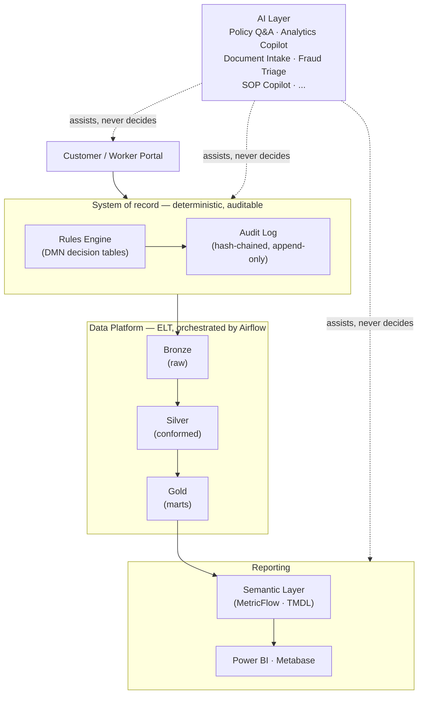

# IES — Integrated Eligibility System

A portfolio project: a rules-driven benefits-eligibility platform —
customer and worker portals, a business-rules engine, a governed data
platform, BI reporting — with an AI capability layer built on top of a
deliberately deterministic, auditable core.

> Independent project inspired by publicly documented patterns in how
> state health & human services eligibility systems generally work. Not
> affiliated with, endorsed by, or built for any government agency or
> vendor. Every applicant record in this repo is synthetic — no real
> individual's data is ever used, scraped, or stored.

## Why this exists

Most portfolio projects are a CRUD app and a README. This one is an
attempt at something closer to what an actual senior/staff engineering
hire looks like on this kind of system: real (public) policy parameters
instead of invented ones, a rules engine instead of nested conditionals,
a governed lakehouse-style data platform instead of a raw dump into
Postgres, and an AI layer that is explicit and disciplined about where AI
belongs in a high-stakes decision system — and where it very much doesn't.

**Built to be read by hiring managers/engineers for**: senior Data
Scientist, Forward Deployed Engineer, Data/Analytics Engineering, BI &
Reporting (Azure Synapse/Fabric-adjacent), and full-stack Java/Spring/React
roles. See [§ Who should look at what](#who-should-look-at-what) below.

## The one governing principle

**AI drafts, flags, explains, and assists. Deterministic systems — the
rules engine, scheduled pipeline jobs — and human reviewers own every
binding decision, every scheduled operation, and every dollar amount.**

This isn't a slogan. It's the direct answer to a well-documented failure
mode in exactly this domain: automated systems that auto-adjudicated
fraud or eligibility with no human in the loop have caused real harm and
real litigation in more than one real government benefits system. Every
AI feature in this repo is scoped to stay on the "assists" side of that
line — see the design docs for how that plays out component by component.

## Architecture, at a glance

Full architecture, every component, and the reasoning behind each choice
live in `docs/design/` — this README stays high-level on purpose.

## Status & roadmap

**Currently in the design phase — implementation has not started yet.**
The full architecture and a five-phase roadmap are designed, reviewed, and
committed; code comes next, phase by phase, each one independently
demoable.

| Phase | Focus | Status |
|---|---|---|
| 1a | Walking skeleton — intake → rules-engine determination → audit trail → warehouse → report page, end to end | Planned |
| 1b | Hardening — identity, caseload-scoped authorization, external interface, orchestration, governance mapping, accessibility, observability | Planned |
| 2 | Policy Intelligence & Analytics AI — RAG-based policy Q&A, rule-authoring copilot, natural-language analytics | Planned |
| 3 | Case Intake & Communication AI — document classification/extraction, AI-drafted correspondence, localization | Planned |
| 4 | Compliance & Integrity AI — fraud risk triage, SLA/QC monitoring, caseworker SOP copilot | Planned |
| 5 | Domain expansion (Medicaid/TANF) & real cloud deployment demos | Planned |

See `docs/design/2026-08-21-full-system-and-phased-roadmap.md` for the
full breakdown of every phase.

## Tech stack

| Layer | Choice |
|---|---|
| Portal | Spring Boot (Java) + React, role-gated customer/worker views |
| Identity | Keycloak (self-hosted OIDC) |
| Rules engine | DMN decision tables on Drools/KIE, against effective-dated policy parameters |
| Data platform | Python, dbt + DuckDB locally, real Delta Lake tables, Postgres serving layer |
| Orchestration | Airflow |
| Reporting | Power BI semantic model as code (TMDL, so it diffs in git), plus a containerized dashboard so the repo renders for anyone who clones it |
| Search / RAG | OpenSearch (hybrid lexical + vector) |
| AI runtime | Local, self-hosted (Ollama) by default — $0 to clone and run |
| Local infra | Docker Compose |
| Cloud target | Documented path to Databricks / Azure Synapse / Microsoft Fabric — and to **Azure Government** specifically, given the FTI-style income data and Phase 5 health data (see below) |

## Compliance & governance

Modeled against real control frameworks, not generic "security best
practices" language: NIST 800-53 access/audit control mapping, IRS
Pub 1075–style handling for income-verification data, HIPAA/HITECH
patterns for Phase 5 health data, and a documented threat model for the
AI layer (trusted policy corpus vs. untrusted user-submitted content).

**On Azure Government specifically**: the data this system is modeled
around is exactly the category real state systems run in Azure Government
rather than commercial Azure — but Azure Government isn't self-service; it
requires the tenant to already be a verified government entity or approved
contractor. This project is honest about that rather than glossing over
it: the infrastructure is written to be Azure-Government-compatible, and
any live demo runs on commercial Azure instead, which still carries
FedRAMP Moderate, HIPAA/HITECH, and NIST 800-53. Full reasoning in
`docs/design/2026-08-21-full-system-and-phased-roadmap.md`.

Full governance framework, fairness-audit approach, and the fraud-triage
design specifically (the highest-scrutiny component in this repo, and
worth reading first if you're evaluating AI judgment rather than just AI
usage) are in the design docs.

## Who should look at what

- **Data Scientist / Forward Deployed Engineer** — `data-platform/` and
  `ai/` once they exist; the synthetic-data methodology and the fraud-
  triage design in the docs are the two highest-signal reads.
- **Reporting / BI, Azure Synapse/Fabric-adjacent** — `reporting/`, the
  data-platform's governed warehouse, and the Azure Government section
  above. Coming from a GUI ETL tool (Informatica, DataStage, SSIS)? See
  the tech-stack doc's §6 for how those concepts map onto this project's
  dbt implementation.
- **Full-stack / Java / Spring / React** — `portal/`.
- **Platform / security / responsible-AI–minded roles** — the governance
  framework and the fraud-triage design.

## Docs

This README is the primary read. For depth: everything else lives in
[`docs/`](docs/) — dated design docs, each one a real record of a design
decision and the reasoning behind it, not after-the-fact documentation.

- [`STATUS.md`](docs/STATUS.md) — live implementation status against the full plan, updated in the same commit as the work it describes
- [`2026-08-20-phase1-vertical-slice.md`](docs/design/2026-08-20-phase1-vertical-slice.md) — the original Phase 1 architecture (partially superseded; kept as a record of how the design evolved)
- [`2026-08-21-full-system-and-phased-roadmap.md`](docs/design/2026-08-21-full-system-and-phased-roadmap.md) — full AI layer + the complete phased roadmap (start here)
- [`2026-08-21-tech-stack-and-production-tradeoffs.md`](docs/design/2026-08-21-tech-stack-and-production-tradeoffs.md) — every stack choice mapped to its real production equivalent, and an explicit account of what was compromised and what each compromise costs

`CLAUDE.md` / `AGENTS.md` are for AI coding assistants working in this
repo, not for a human reader evaluating the project.

## License

MIT.
