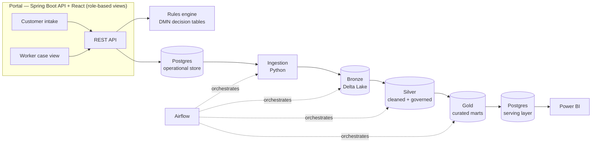

# Canopica — Phase 1 Design: End-to-End Vertical Slice

Status: **partially superseded** — kept as a record of how the design
evolved, not as current guidance
Date: 2026-08-20
Superseded by: `2026-08-21-full-system-and-phased-roadmap.md`

> **Read the roadmap doc, not this one, where they disagree.** The
> architecture and governance framework below still hold. Four things have
> changed since: the DMN runtime (now Drools/KIE, not Camunda), the
> reporting toolchain (now TMDL model-as-code plus a containerized
> dashboard, not `.pbix`), the audit-log design (now hash-chained and
> CI-verified), and Phase 1's shape (now split into 1a/1b). The roadmap doc
> also adds the domain model, effective-dating, and determination-trace
> design this doc was missing entirely. One external fact below may also
> have gone stale: §7's reference to a free Databricks Community Edition —
> verify the current free tier before relying on it.

## 1. What Canopica is

Canopica is a portfolio project demonstrating how a
government health & human services benefits agency might design, build, and
govern a modern eligibility and enrollment platform: a customer-facing
application portal, a caseworker portal, a business-rules engine that
determines eligibility, and a governed data platform feeding compliance and
program-integrity reporting.

This is an independent project inspired by publicly documented patterns in
how state health & human services eligibility systems generally work. It is
not affiliated with, endorsed by, or built for any government agency or
vendor, and it does not use or reference any real applicant data.

**Audience**: this repo is written to be read by hiring managers/engineers
for senior data engineering, data science, forward-deployed engineering,
BI/reporting, and full-stack roles. The README maps each subsystem to the
skills it demonstrates (see §9).

## 2. Full vision vs. Phase 1

The long-run vision (documented for roadmap purposes, not built yet) covers
customer and worker portals across every domain area of a real eligibility
interview — individual information, income, expenses, living arrangements,
work activities, health care, disability, education, head of household,
demographics, deductions, pathways, pregnancy — feeding a rules engine that
determines eligibility and benefit amount, plus later phases for
correspondence generation, external system interfaces (wage data, tax data,
identity verification), and reference/configuration tables.

**Phase 1 builds one thin vertical slice through that whole stack**, end to
end, rather than any one layer in full depth. Building the whole domain
model before anything runs end-to-end would mean nothing is demoable for a
long time; a vertical slice proves the architecture holds together first,
and every later phase widens it.

### Phase 1 scope: SNAP, one applicant journey

Phase 1 implements a single benefit program — SNAP (food assistance) —
because it has real, public, federally defined policy parameters (income
tests, standard/earned-income/dependent-care/medical/shelter deductions,
categorical eligibility) with no state-specific variation to model yet. It
still exercises most of the intake domains listed above (income, expenses,
household composition, demographics, disability/elderly-related deductions,
work activity/exemption status) — just not the Medicaid/TANF-specific ones
(pregnancy, MAGI household composition, cash-assistance work pathways),
which are explicitly out of scope here and named in §8.

The slice: **customer portal intake → worker portal case view → rules
engine determination → event lands in the data pipeline → governed/curated
in the warehouse → visible in a Power BI report.** Every layer is real and
runs; none of it is a mock.

## 3. Architecture



All of it runs locally via Docker Compose. No cloud account is required to
clone and run this repo.

## 4. Component choices and rationale

| Layer | Choice | Rationale |
|---|---|---|
| Portal | Spring Boot (Java) API + one React app, role-gated views for customer vs. worker | Matches full-stack Java/Spring/React background directly; one app with two role-based view sets avoids doubling the build while still demonstrating both portal concepts |
| Rules engine | DMN decision tables, evaluated via Camunda's standalone open-source DMN engine embedded in the Spring Boot service | DMN (an OMG standard) is the closest open equivalent to how commercial policy-automation tools model rules as decision tables — rules are authored as data (XML decision tables), not hard-coded conditionals. Drools is the documented fallback if SNAP's deduction-stacking logic needs more expressiveness than a decision table cleanly gives |
| Ingestion + transform | Python; `dbt-duckdb` project running against local DuckDB; medallion architecture (bronze/silver/gold) persisted as real Delta Lake tables via the open-source `deltalake` package | Same dbt project and same Delta table format used by managed lakehouse platforms — moving this to a managed lakehouse later is a dbt profile swap plus a storage location change, not a rewrite (see §7) |
| Orchestration | Airflow, local via Docker Compose | Widely recognized; DAG concepts transfer directly to managed pipeline/orchestration services |
| Serving/warehouse | Postgres, materialized gold layer | Reliable, well-supported Power BI Desktop connector — avoids flaky local ODBC setups |
| Reporting | Power BI Desktop; `.pbix` checked into `reporting/`, plus exported screenshots/PDF in the README | No paid BI service account required to ship or view this |
| Governance | RBAC via Spring Security (customer/worker/admin); column-level PII/sensitivity tags in dbt `schema.yml`; tokenized handling of SSN-like fields; an immutable audit-log table for every eligibility determination event | See §6 for the specific control framework this is modeled against |
| Local infra | Docker Compose: Postgres, Airflow, Spring Boot, React, MinIO (S3-compatible object storage standing in for cloud object storage) | One `docker-compose up` runs the entire stack |
| Cloud deployment path (documented, not deployed by default) | `infra/azure/` — Terraform for cloud object storage, a managed lakehouse/warehouse workspace, secrets management, and app hosting | Reference IaC only in Phase 1; see §7 |
| CI | GitHub Actions: build/lint/test across Java, Python, and React on every push | Keeps the "production-grade" claim honest |

## 5. Data

**Source distributions**: U.S. Census ACS PUMS (public, legally available
person/household microdata — income, household size, disability,
employment, education, age) drive the shape of a synthetic-applicant
generator (Python). **Policy parameters**: published SNAP income limits,
deduction standards, and federal poverty guidelines (public,
real) — so the rules engine's thresholds are authentic, not invented.

**Every applicant record in this repo is synthetic.** No real individual's
data is ever used, scraped, or stored. This is stated explicitly in the
README as a deliberate privacy-by-design decision, not an oversight — a
production system would need certified data-sharing agreements and consent
flows this project deliberately does not attempt to simulate.

## 6. Governance & compliance framework

Modeled against, and documented with an explicit mapping to, patterns real
benefits-eligibility systems are built to:

- **Access control** — Spring Security RBAC (customer/worker/admin roles),
  mapped to NIST 800-53 AC-2/AC-3 in `docs/design/compliance-mapping.md`
  (written in a later step, not this one).
- **Audit accountability** — every rules-engine determination writes an
  immutable audit event (actor, timestamp, inputs, outcome), mapped to
  AU-2/AU-3.
- **Data protection at rest/in transit** — TLS for all API traffic;
  column-level tokenization for SSN-like fields even though the data is
  synthetic, because the goal is to demonstrate the control, not just rely
  on the data being fake. Mapped to SC-13/SC-28.
- **Federal Tax Information–style handling** — income fields are treated
  with the same strict masking/access-scoping a real system would apply to
  IRS-sourced income verification data, since a later phase's "interfaces"
  work would introduce a real one.
- **Privacy by design** — synthetic-data-only policy (§5), documented data
  classification per column, no production PII ever in this repo.

This is implemented where it's demonstrable in code (RBAC, tokenization,
audit log) and documented in full elsewhere for the parts that would need
real infrastructure to be meaningful (data-sharing agreements, formal
compliance audit).

## 7. Where Databricks / Synapse / Fabric fit

Phase 1 intentionally runs the whole data platform locally (DuckDB + dbt +
Delta Lake + Postgres) with no cloud account required. That was a deliberate
choice, not a limitation the project fell into — no cloud access was
available going in, and a trial-credential-driven demo risks quietly
breaking when the trial expires.

The path to each target platform is real, not aspirational hand-waving:

- **Databricks**: the dbt project and Delta table format are unchanged.
  Swapping the `dbt-duckdb` profile for `dbt-databricks` and pointing table
  storage at a Databricks-managed location is the entire migration. Databricks
  Community Edition is free, so this can later be demoed for real without
  changing any transformation logic.
- **Azure Synapse / Microsoft Fabric**: `infra/azure/` documents (via
  Terraform) the shape of a production deployment — cloud object storage
  in place of local MinIO, a Synapse workspace or Fabric Lakehouse in place
  of local Postgres/DuckDB, Fabric Data Factory or Synapse Pipelines in
  place of local Airflow, and Direct Lake mode Power BI reporting straight
  off the Fabric Lakehouse instead of a materialized Postgres export.

Both paths are documented explicitly in `docs/design/` (a dedicated cloud
deployment doc, written when that work starts) rather than only implied by
this section.

## 8. Explicitly out of scope for Phase 1

- Medicaid and TANF domain logic (pregnancy, MAGI household rules, cash
  assistance work pathways) — Phase 2.
- Correspondence generation (eligibility notices) — later phase.
- External interfaces (wage data, tax data, identity verification) — later
  phase; SNAP's "as-if-FTI" income handling in §6 is designed so this slots
  in without rework.
- Reference/configuration table administration UI — later phase.
- Real cloud deployment of Databricks/Synapse/Fabric — documented path only
  (§7); may be demoed live later without changing the architecture.
- Splitting the customer and worker portals into two separate applications
  — Phase 1 uses one React app with role-gated views; documented as a
  deliberate simplification, not an oversight.
- Multi-repo split — single monorepo for Phase 1 and likely beyond, per
  explicit preference for ease of review.

## 9. Role-to-subsystem mapping (for the README)

- **Data Scientist / Forward Deployed Engineer** — synthetic-data
  generation methodology, the rules engine, the dbt medallion pipeline.
- **Reporting / BI, Azure Synapse/Fabric-adjacent roles** — the governed
  warehouse, Power BI reporting, and the documented cloud deployment path.
- **Full-stack / Java / Spring / React** — the portal application itself.
- **Platform/security-minded roles** — the governance and compliance
  framework in §6.

## 10. Testing strategy (brief — detailed in the implementation plan)

- Rules engine: DMN decision tables are directly unit-testable — one test
  per SNAP eligibility scenario (gross/net income pass/fail, each deduction
  applied correctly, categorical eligibility override).
- Data platform: dbt tests (`not_null`, `unique`, `accepted_values`,
  referential integrity) on every model; a handful of custom tests
  asserting no raw PII-shaped fields reach the gold layer unmasked.
- Portal: Spring Boot integration tests for the API; React Testing Library
  for the UI.
- CI runs all of the above on every push.

## 11. Repo layout

```
canopica/
  README.md                 <- primary read: what it is, architecture, quickstart, role map
  docs/
    design/                 <- this doc and future design docs
  portal/                   <- Spring Boot API + React app
  rules-engine/             <- DMN decision tables + evaluation service
  data-platform/            <- dbt project, ingestion scripts, Airflow DAGs
  reporting/                <- Power BI .pbix + exported views
  infra/
    docker-compose.yml      <- local stack
    azure/                  <- reference Terraform (not deployed by default)
  .github/workflows/        <- CI
```

## 12. Open risks / known limitations

- DMN decision tables may not cleanly express SNAP's deduction-stacking
  order; Drools is the documented fallback (§4) if so.
- Power BI Desktop `.pbix` files are binary and don't diff well in git —
  accepted trade-off for zero-cost reporting; exported screenshots/PDF in
  the README keep the report reviewable without opening Power BI.
- Single combined React app (not two separate portals) is a simplification
  that trades a small amount of realism for materially less build effort;
  documented in §8 rather than silently done.
