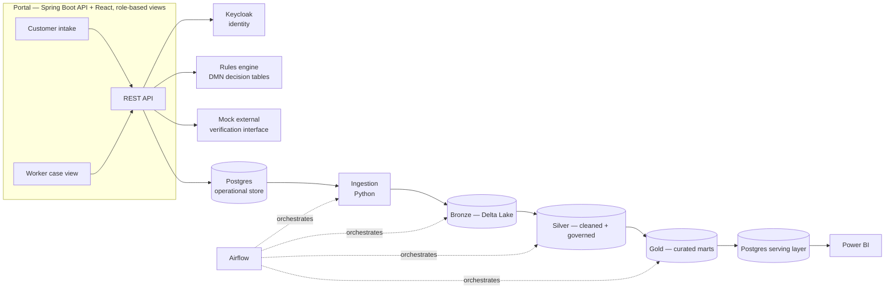
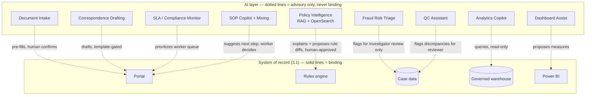
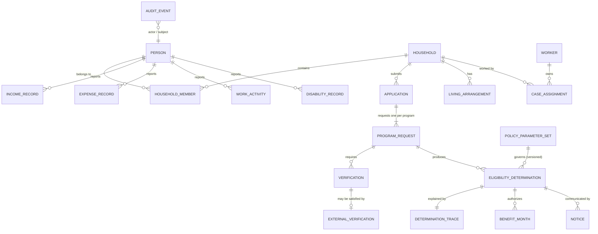

# Canopica — Full System Design & Phased Roadmap

Status: approved
Date: 2026-08-21
Supersedes/expands: `2026-08-20-phase1-vertical-slice.md`. That doc's
architecture and governance framework still apply; this one adds the AI
layer brainstormed afterward, adds the domain/temporality/audit design it
was missing, and reorganizes everything into a complete phased roadmap. It
is kept as a separate dated doc rather than overwritten, since the original
is a legitimate record of how the design evolved — a small piece of
authentic engineering process worth letting a reader see.

**Where this doc overrides it** (read this doc, not that one, on these
four points):

| Topic | Phase 1 doc said | Now |
|---|---|---|
| DMN runtime | Camunda open-source engine, Drools as fallback | Drools/KIE as primary (§3.3) |
| Reporting toolchain | Power BI Desktop, `.pbix` in the repo | TMDL model-as-code + Power BI Service + Metabase container (§3.3) |
| Audit log | "immutable audit-log table" | Hash-chained and CI-verified (§3.6) |
| Phase 1 shape | One block | Split 1a / 1b (§5) |

## 1. What changed since Phase 1's design

The original design was one vertical slice: portal → rules engine → data
pipeline → Power BI, for a single SNAP applicant journey. Since then, a
second brainstorming pass added a full AI capability layer on top of that
same core — policy explainability, analytics, document processing,
correspondence, fraud triage, compliance monitoring, and SOP guidance. This
doc captures all of it and organizes the combined system into phases that
are each independently shippable.

## 2. The one governing principle

**AI drafts, flags, explains, and assists. Deterministic systems — the DMN
rules engine, scheduled pipeline jobs, and human reviewers — own every
binding decision, every scheduled operation, and every dollar amount.**

This isn't a slogan, it's the answer to a specific, well-documented failure
mode in this exact domain: Michigan's MiDAS system auto-adjudicated
unemployment fraud with a false-positive rate over 90%, with no human in
the loop; Arkansas's Medicaid home-care algorithm was struck down in court
for being an unauditable black box; the Netherlands' childcare-benefits
algorithm disproportionately flagged families by nationality and brought
down the government. Every AI capability in this doc is scoped to stay on
the "assists" side of that line, and it's called out explicitly per
component below, not left implicit.

## 3. Architecture

### 3.1 System of record (deterministic — unchanged from Phase 1's design)



### 3.2 AI capability layer (advisory — new)



### 3.3 Cross-cutting decisions (apply across every phase)

| Decision | Choice | Rationale |
|---|---|---|
| AI runtime, default | **Ollama**, local, self-hosted — one small generation model, one embedding model | Zero marginal cost, no API key required to clone and run the repo. Every AI capability below runs on this by default. |
| AI runtime, public demo | Small hosted-API budget, hard-capped | Free-tier hosting can't fit even a small quantized LLM at usable latency. A hosted API gives a genuinely good public demo, bounded by a server-side per-session/day rate limit *and* a provider-level hard spend cap as backstop — degrades to "unavailable" under abuse, never a surprise bill. |
| Vector + lexical search | **OpenSearch**, k-NN plugin for vectors alongside its normal full-text search | One system instead of a separate vector DB plus a separate search engine — hybrid retrieval out of the box. |
| Semantic layer for analytics | **MetricFlow** (dbt Labs' open-source package, not the paid dbt Cloud service) | Governed, named, tested metrics the analytics copilot maps questions to — dramatically safer and more accurate than letting an LLM write raw SQL against physical tables. |
| Identity | **Keycloak**, self-hosted OIDC, two realms (citizen self-service, worker/enterprise SSO simulation) | Free, standard, and gives the RBAC story in the governance framework something concrete to sit on instead of hand-rolled auth. |
| Trustworthy-AI CI gates | An eval suite (golden questions, scored for groundedness/citation accuracy) for the Policy Q&A system; a fairness-audit check (disparate-impact ratio across ACS-PUMS demographic slices) for the rules engine *and* the fraud-triage model | Same discipline as dbt tests gating the pipeline — these run in CI and block a merge on regression, not just get described in a doc. |
| Fairness reporting | The fairness-audit numbers also render as a Power BI page, not only a CI gate | A gate proves it's enforced; a report proves it's visible to stakeholders. Shares its underlying computation with the CI gate. |
| No-proxy-features policy | Fraud-triage model explicitly excludes nationality, name-origin patterns, and zip-code-as-race-proxy | This is exactly what the Dutch childcare-benefits algorithm got wrong. Documented as a deliberate exclusion, not an oversight. |
| Threat model | The policy-document corpus is trusted; anything derived from applicant-submitted free text or uploaded documents is untrusted input to the AI layer, never concatenated into a prompt with policy-document authority | Standard prompt-injection boundary for a RAG system that also ingests user content. |
| Observability | OpenTelemetry traces/metrics/logs across the API and data pipeline (general system health) **plus** AI-specific observability — token usage, latency, RAG groundedness scores (per-component health) | Two different things; both are in scope. The general layer doesn't get replaced by the AI-specific one. |
| Accessibility | Section 508/WCAG-conformant portal (a11y linting, ARIA-correct components) | Actually non-negotiable for real government portals — cheap to add, and almost no portfolio project bothers, which makes it a disproportionately authentic detail. |
| DMN runtime | **Drools / KIE** (`kie-dmn`), embedded in the Spring Boot service | Apache 2.0, actively developed, DMN-conformant. Supersedes the Phase 1 doc's Camunda choice: Camunda 7's community support has ended and Camunda 8 changed the engine's licensing posture. KIE also collapses the fallback into the primary — the Phase 1 doc named Drools as the backup if decision tables can't express SNAP's deduction stacking, and starting on KIE means DMN tables *and* DRL rules come from one runtime with no migration. |
| Reporting toolchain | Semantic model authored as **TMDL text files**; visuals in the free Power BI Service; a containerized OSS dashboard (Metabase) in `docker-compose` | Power BI Desktop is Windows-only and this project is developed on macOS. Model-as-code also resolves the Phase 1 doc's §12 risk about `.pbix` binaries not diffing in git — the model becomes reviewable source. The OSS dashboard means the repo renders something real for anyone who clones it, rather than requiring a Power BI install to see any reporting at all. |
| Temporality | Effective-dated policy parameter sets; every determination stamped with its parameter-set version | See §3.6. Without this, no determination is reproducible as of its decision date, and Phase 4's QC assistant cannot function. |
| Audit integrity | Hash-chained, append-only audit log with a CI verification job | See §3.7. Turns "immutable audit log" from a claim into a control a reader can verify. |
| Authorization depth | RBAC **plus** caseload-scoped row-level filtering, sensitive-case flagging, and access-review reporting | The characteristic real-world breach in benefits systems is not privilege escalation — it is an authorized worker viewing a case they have no business reason to touch. Roles don't prevent that; row scoping does. Maps to NIST AC-3(3)/AC-6. Built in Phase 1b. |

### 3.4 Domain model

Both prior docs named *screens* (income, expenses, living arrangements…)
but never *entities*. That gap matters more than it looks: the entity model
is what the rules engine reads, what dbt sources, what correspondence
merges from, and what the QC assistant re-derives against. Designed once
here so Phase 1 doesn't invent it ad hoc.

#### 3.4.1 Operational core



Entity notes worth stating rather than leaving implied:

- **`PROGRAM_REQUEST`** is the unit of eligibility, not `APPLICATION`. One
  application commonly requests several programs, each of which is
  determined separately, on its own timeline, with its own outcome. Real
  systems that conflate the two struggle later; this one doesn't.
- **`ELIGIBILITY_DETERMINATION`** is the binding record: program, benefit
  month, eligible yes/no, benefit amount, the parameter-set version used,
  decided-at, decided-by, and a foreign key to its trace. It is
  append-only — a changed circumstance produces a *new* determination, it
  never mutates an existing one.
- **`DETERMINATION_TRACE`** persists the full DMN evaluation: the input
  snapshot as of decision time, which rules fired, and intermediate values
  (gross income test, each deduction applied in order, net income test).
  This is a Phase 1 deliverable precisely because Phase 2's policy Q&A and
  Phase 4's QC assistant both already assume it exists — see §3.6.
- **`POLICY_PARAMETER_SET`** holds the effective-dated federal thresholds
  and deduction standards. Versioned, never edited in place.
- **`VERIFICATION`** tracks each outstanding data element, its due date,
  and how it was satisfied — this is what drives the intake pipeline in
  Phase 3 and the SLA monitor in Phase 4.
- **`CASE_ASSIGNMENT`** is what makes caseload-scoped authorization
  possible at all. Without it, row-level access control has nothing to
  filter on.
- Every intake entity (`INCOME_RECORD`, `EXPENSE_RECORD`,
  `LIVING_ARRANGEMENT`, `WORK_ACTIVITY`, …) carries effective-from /
  effective-to dates. Households report changes mid-month constantly; a
  model that only stores "current" values cannot answer what was true in
  March.

#### 3.4.2 Reporting model

The warehouse is designed here too, not left to emerge from whatever the
operational schema happens to look like:

| Layer | Tables |
|---|---|
| **Bronze** | Raw, append-only landings of each operational table, with ingest metadata. No reshaping. |
| **Silver** | `dim_person`, `dim_household`, `dim_worker`, `dim_program`, `dim_policy_parameter_set` (SCD Type 2 — the dimension that makes as-of reporting work), `fct_application`, `fct_program_request`, `fct_eligibility_determination`, `fct_verification`, `fct_benefit_month`, `fct_audit_event`. Cleaned, conformed, PII classified and tokenized per column. |
| **Gold** | `mart_processing_timeliness` (against SNAP's real 30-day and 7-day expedited standards), `mart_determination_outcomes`, `mart_payment_accuracy` (the QC / error-rate view), `mart_fairness_audit` (shared computation with the CI gate, per §3.3), `mart_worker_caseload`, `mart_access_review` (who looked at which case, and whether they had a reason to). |

`fct_eligibility_determination` carries the parameter-set version as a
foreign key to the SCD-2 dimension, which is what lets a report say "under
the rules in force at the time" rather than silently re-scoring history
against today's thresholds.

### 3.5 Temporality and determination reproducibility

Eligibility systems are fundamentally temporal, and getting this wrong is
not a detail that can be patched later:

- Federal SNAP thresholds change annually on a fixed date.
- Households report changes mid-month; benefits are computed per benefit
  month.
- A determination must be reproducible **as of the date it was made**, on
  demand, years later — for appeals, for audits, and for QC.

The design response, all of it Phase 1a:

1. `POLICY_PARAMETER_SET` is effective-dated and immutable once published.
2. Every `ELIGIBILITY_DETERMINATION` stores the parameter-set version it
   used, not a pointer to "current."
3. DMN evaluation takes an explicit as-of date and resolves both parameters
   and intake facts against it.
4. `DETERMINATION_TRACE` persists the whole evaluation, so re-derivation
   can be checked against what actually happened rather than merely
   re-run and hoped to match.

Phase 4's QC / Payment Error Rate Assistant depends on all four. Its entire
function is re-deriving what a case *should* have produced and flagging the
delta — which is impossible if the inputs and thresholds it re-runs against
have silently moved.

### 3.6 Tamper-evident audit log

The Phase 1 doc calls for an "immutable audit-log table." A table is not
immutable; anyone holding `UPDATE` can rewrite history. Upgraded to
something a reader can actually verify:

- Each `AUDIT_EVENT` row carries the hash of its predecessor's hash plus
  its own payload, forming a chain.
- `UPDATE` and `DELETE` are revoked from the application role at the
  database level; the app can only append.
- A CI job walks the chain and fails the build if it doesn't verify.

Roughly forty lines of work, and it converts a governance claim into a
demonstrated control — which is the difference this repo is trying to make
throughout.

### 3.7 Government cloud & compliance tier

The data this system is modeled around — income data handled with FTI-style
safeguards from Phase 1, and Medicaid-adjacent health data from Phase 5 —
is exactly the category real state systems run in **Azure Government**
rather than commercial Azure: a physically and logically separate Azure
instance, restricted to U.S. federal/state/local government entities and
their vetted partners, staffed only by screened U.S. persons, carrying
FedRAMP High, DoD IL2/IL4/IL5, IRS 1075, and HIPAA/HITECH accreditation
already baked in. IRS Pub 1075 specifically leans on that screened-personnel
requirement in a way commercial-cloud support staffing doesn't automatically
satisfy — it's the reason real FTI-adjacent workloads default to Gov cloud
even when the technical controls could theoretically be replicated
elsewhere.

**Honest constraint, stated plainly rather than glossed over**: Azure
Government is not self-service. Provisioning it requires the tenant to
already be a verified U.S. government entity or an approved contractor
acting on one's behalf — there is no individual/personal signup path, so
this portfolio project cannot actually run in it. The design response,
consistent with the Databricks/Synapse/Fabric pattern in §7 of the Phase 1
doc: `infra/azure/` is written to be Azure-Government-compatible (documented
`usgovcloud` endpoint/provider-alias swap, called out explicitly rather than
buried), and the README states outright *"designed for Azure Government;
demoed on commercial Azure because Government access requires an actual
government/contractor relationship this personal project doesn't have —
here's exactly what would change to retarget it."* Commercial Azure itself
still supports FedRAMP Moderate, HIPAA/HITECH BAAs, and NIST 800-53 — a
real, individually-accessible environment for the actual demo, just not the
Gov-specific isolation tier. (Microsoft Fabric's Government-cloud
availability is newer and narrower than Synapse's long-standing Gov
presence — verify current status against Microsoft's own documentation
before stating anything specific about it in the README, rather than
assuming parity with Synapse.)

## 4. Data

Unchanged from the Phase 1 doc, plus one addition: the real, public SNAP
policy manuals/CFR sections/USDA guidance that back the rules engine's
thresholds are now also the **RAG corpus** for Policy Intelligence — the
same documents serve both purposes, so the explainability answers and the
rules engine are grounded in the same source of truth by construction.

## 5. Phased roadmap

Each phase is independently shippable and demoable. Later phases depend on
earlier ones existing (there's real case data to analyze, real policy docs
already indexed, etc.) — building AI-on-top-of-nothing would make features
like fraud triage or SOP mining meaningless, so the sequence isn't
arbitrary.

### Phase 1 — Core system of record

The deterministic foundation. One SNAP applicant journey, fully working,
nothing mocked except the identity of the "other agency" on the far end of
one interface.

Split into two increments. The scope is the same either way; the split
exists so there is never a stretch where nothing runs. Phase 1a is
demoable, and from that point every commit improves something that already
works — rather than the repo sitting simultaneously half-finished in ten
directions, which is the failure §8 says the phase boundaries exist to
prevent.

#### Phase 1a — walking skeleton

The thinnest path that touches every layer and produces a real, correct,
auditable determination:

- Portal: intake form + worker case view (Spring Boot + React, roles
  hardcoded for now — no Keycloak yet)
- Domain model per §3.4.1, with effective dating per §3.5 built in from
  the start
- Rules engine: DMN decision tables on Drools/KIE, evaluated against an
  effective-dated `POLICY_PARAMETER_SET`
- `ELIGIBILITY_DETERMINATION` + persisted `DETERMINATION_TRACE`
- Hash-chained audit log per §3.6, with its CI verification job
- Data platform: one dbt model path through bronze → silver → gold
- Reporting: one report page, plus the Metabase dashboard container
- Synthetic-applicant generator (ACS PUMS–driven)
- Docker Compose + CI (build/lint/test/dbt-test)

#### Phase 1b — hardening

Everything that makes it production-shaped rather than merely working:

- Identity (Keycloak — citizen + worker realms)
- **Row-level authorization**: caseload-scoped access via
  `CASE_ASSIGNMENT`, sensitive-case flagging, and the `mart_access_review`
  reporting page (§3.3)
- Mock external verification interface (wage/income stand-in, with the
  FTI-style safeguards from the governance framework actually applied to
  it — this is what makes "interfaces" a real, working thing instead of a
  roadmap bullet)
- Data platform widened: full medallion coverage of §3.4.2's tables, real
  Delta Lake tables, Postgres serving layer, Airflow orchestration
- Reporting widened: applications, determinations, processing time
  against SNAP's real 30-day / 7-day standards
- Governance framework completed (tokenized SSN-like fields, column-level
  classification, NIST 800-53 / IRS Pub 1075–style control mapping in
  `docs/design/compliance-mapping.md`)
- Accessibility (Section 508/WCAG)
- Observability (OpenTelemetry across API + pipeline)
- Documented cloud path (reference Terraform for Azure, not deployed by
  default)

### Phase 2 — Policy Intelligence & Analytics AI

Builds directly on Phase 1's governed warehouse and (now-indexed) policy
documents:

- OpenSearch ingesting the real SNAP policy corpus (hybrid lexical + k-NN
  vector search)
- Policy Q&A / explainability RAG — "why was I denied," grounded in the
  actual DMN trace, citing source policy text
- Rule-authoring copilot — proposes a DMN decision-table diff from a
  changed policy document; a human always reviews and approves before it's
  live
- Analytics Copilot — natural language mapped to governed MetricFlow
  metrics, generated SQL always shown, read-only DB role
- Dashboard authoring assist — LLM proposes a dashboard spec and DAX
  measures, pushed via the free Tabular Editor CLI
- Eval-suite CI gate for Policy Q&A groundedness/citation accuracy
- **Public hosted demo goes live here** — this is the first point where
  there's something genuinely interactive worth putting in front of a
  recruiter, not just a static portal

### Phase 3 — Case Intake & Communication AI

Builds on Phase 1's portal and case model:

- Intelligent Document Intake — classify/extract/route across document
  types (income reports, renewal packets, work activity reports,
  verification-checklist documents), checked against each case's
  outstanding verification checklist, worker-confirmed before use
- AI-drafted correspondence — eligibility notices drafted from the DMN
  determination and audit trail, template/validation gate before a notice
  is considered sent
- Translation/localization of the portal and correspondence

### Phase 4 — Compliance & Integrity AI

The most sensitive tier — genuinely needs real case history/volume to be
meaningful, which is why it comes after intake and correspondence exist:

- Fraud Risk Triage — anomaly scoring surfaces cases to a human
  investigator's queue only, never auto-adjudicates; fairness-audited via
  the same CI gate as the rules engine; explicitly excludes
  protected-class-proxy features
- Fairness-audit results extended and surfaced as a Power BI report page
- Case SLA/Compliance Monitor — deterministic deadline tracking (SNAP's
  real 30-day/7-day expedited processing requirements) plus an
  AI-prioritized, AI-summarized at-risk worker queue
- QC / Payment Error Rate Assistant — modeled on SNAP's real,
  federally-mandated Quality Control process; re-derives what a case
  should have produced and flags discrepancies for a QC reviewer
- Caseworker SOP Copilot — in-the-moment next-step procedural guidance
  per case type (new application / reported change / renewal)
- SOP Process-Improvement Mining — analyzes case and audit outcomes over
  time to suggest where the SOPs themselves should change
- Data-quality anomaly detection on refreshed fact tables, plus
  AI-drafted root-cause summaries when a pipeline/dbt test fails

### Phase 5 — Domain expansion & cloud realization

- Medicaid/TANF domain logic (pregnancy, MAGI household rules, cash-
  assistance work pathways)
- Correspondence and interfaces breadth beyond SNAP
- Real cloud deployment demos: the existing dbt project run for real on
  a free Databricks tier, and the existing Terraform applied to an Azure
  free trial for a real screenshot. Two things to verify at the time
  rather than assume now — Databricks replaced Community Edition with a
  differently-scoped free tier, so confirm what the current free offering
  actually permits before promising this in the README; and target
  **Fabric first, Synapse second**, since Microsoft's investment has moved
  to Fabric even though Synapse remains widely deployed in government
  (where cloud offerings lag commercial by years, which is itself worth a
  sentence in the README)

## 6. Repo layout (updated)

```
canopica/
  README.md
  docs/
    STATUS.md               <- authoritative implementation tracker; read first
    design/                 <- dated design docs (this one + Phase 1's)
  portal/                   <- Spring Boot API + React app
  rules-engine/             <- DMN decision tables + evaluation service
  data-platform/             <- dbt project, ingestion scripts, Airflow DAGs
  ai/
    policy-intelligence/    <- OpenSearch ingestion, RAG Q&A, rule-authoring copilot
    analytics-copilot/      <- MetricFlow + NL-to-metric service
    dashboard-assist/       <- DAX/Tabular Editor generation
    document-intake/        <- classify/extract/route pipeline
    correspondence/         <- notice drafting
    fraud-triage/           <- anomaly scoring service
    compliance/             <- SLA monitor, QC assistant
    sop-copilot/            <- worker guidance + SOP mining
  identity/                 <- Keycloak realm config
  reporting/
    semantic-model/         <- TMDL model-as-code (reviewable in PRs)
    powerbi/                <- Service screenshots + import instructions
    dashboard/              <- containerized OSS dashboard (runs on clone)
  infra/
    docker-compose.yml
    azure/                  <- reference Terraform (not deployed by default)
  .github/workflows/
```

## 7. Role-to-subsystem mapping (updated)

- **Data Scientist / Forward Deployed Engineer** — synthetic-data
  methodology, the rules engine, the dbt pipeline, and nearly everything
  in `ai/` — this is now the largest single signal in the repo.
- **Reporting / BI, Azure Synapse/Fabric-adjacent roles** — the governed
  warehouse, Power BI (including the fairness report), the analytics
  copilot, dashboard-authoring assist, and the documented cloud path.
- **Full-stack / Java / Spring / React** — the portal itself, Keycloak
  integration.
- **Platform / security / responsible-AI–minded roles** — the governance
  framework, the trustworthy-AI CI gates, the threat model, and the
  fraud-triage design specifically (it's the strongest single artifact for
  demonstrating AI judgment in a high-stakes domain).

## 8. Open risks / known limitations (updated)

- From the Phase 1 doc's §12: the single combined React app (rather than
  separate citizen and worker applications) still stands as a deliberate
  simplification. The other two risks it listed are now closed — `.pbix`
  binary diffing goes away with TMDL model-as-code, and the DMN
  expressiveness risk shrinks considerably now that Drools/KIE gives DMN
  tables and DRL rules from one runtime (§3.3).
- **The fairness audit runs on synthetic data, which bounds what it can
  claim.** Applicant records are generated from public census
  distributions, so a disparate-impact measurement over them partly
  measures the generator's own assumptions. What the audit demonstrates is
  that the measurement, the threshold, and the CI gate work and would
  catch a regression — not that any model here is fair in the world.
  Stated explicitly wherever fairness results are shown, since claiming
  more than that would be exactly the overstatement §2's governing
  principle exists to prevent. Full treatment in
  `2026-08-21-tech-stack-and-production-tradeoffs.md` §4.9.
- This is now a large system for a solo project. Phase boundaries exist
  specifically so each phase ships and is demoable on its own — if time
  runs out after Phase 2 or 3, the repo still tells a complete, coherent
  story rather than being uniformly half-finished.
- The hosted public demo's hard spend cap means it can fail closed
  ("temporarily unavailable") under unexpected load — documented as an
  intentional trade-off, not a bug, if it ever happens.
- Fraud Risk Triage is the single highest-scrutiny component in the repo
  precisely because of what it's modeled to avoid; its README section
  should lead with the "triage, not adjudication" framing and the
  no-proxy-features policy before describing how it works.
