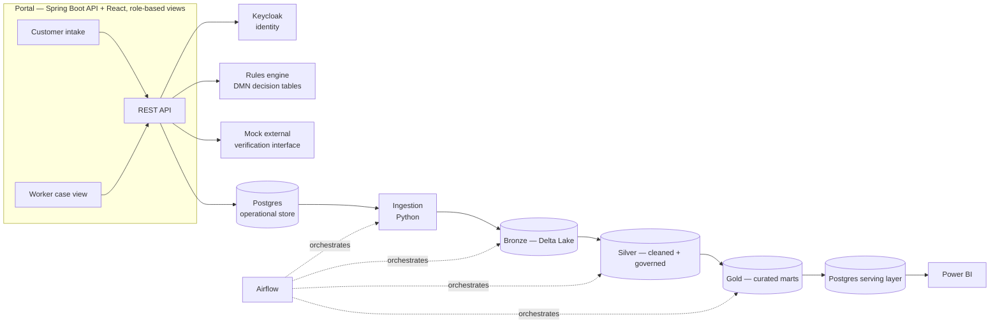
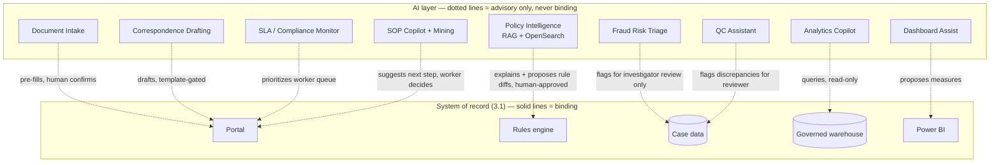

# Canopica — Full System Design & Phased Roadmap

Status: approved
Date: 2026-08-21
Supersedes/expands: `2026-08-20-phase1-vertical-slice.md` (that doc's architecture,
stack choices, and governance framework are unchanged and still apply — this
doc adds the full AI layer that was brainstormed afterward, and reorganizes
everything into a complete phased roadmap. Kept as a separate dated doc
rather than overwritten, since the original is a legitimate record of how
the design evolved — a small piece of authentic engineering process worth
letting a reader see.)

## 1. What changed since Phase 1's design

The original design was one vertical slice: portal → rules engine → data
pipeline → Power BI, for a single SNAP applicant journey. Since then, a
second brainstorming pass added a full AI capability layer on top of that
same core — policy explainability, analytics, document processing,
correspondence, fraud triage, compliance monitoring, and SOP guidance. This
doc captures all of it and organizes the combined system into phases that
are each independently shippable.

## 2. The one governing principle

**AI drafts, flags, explains, and assists. Deterministic systems — the DMN
rules engine, scheduled pipeline jobs, and human reviewers — own every
binding decision, every scheduled operation, and every dollar amount.**

This isn't a slogan, it's the answer to a specific, well-documented failure
mode in this exact domain: Michigan's MiDAS system auto-adjudicated
unemployment fraud with a false-positive rate over 90%, with no human in
the loop; Arkansas's Medicaid home-care algorithm was struck down in court
for being an unauditable black box; the Netherlands' childcare-benefits
algorithm disproportionately flagged families by nationality and brought
down the government. Every AI capability in this doc is scoped to stay on
the "assists" side of that line, and it's called out explicitly per
component below, not left implicit.

## 3. Architecture

### 3.1 System of record (deterministic — unchanged from Phase 1's design)



### 3.2 AI capability layer (advisory — new)



### 3.3 Cross-cutting decisions (apply across every phase)

| Decision | Choice | Rationale |
|---|---|---|
| AI runtime, default | **Ollama**, local, self-hosted — one small generation model, one embedding model | Zero marginal cost, no API key required to clone and run the repo. Every AI capability below runs on this by default. |
| AI runtime, public demo | Small hosted-API budget, hard-capped | Free-tier hosting can't fit even a small quantized LLM at usable latency. A hosted API gives a genuinely good public demo, bounded by a server-side per-session/day rate limit *and* a provider-level hard spend cap as backstop — degrades to "unavailable" under abuse, never a surprise bill. |
| Vector + lexical search | **OpenSearch**, k-NN plugin for vectors alongside its normal full-text search | One system instead of a separate vector DB plus a separate search engine — hybrid retrieval out of the box. |
| Semantic layer for analytics | **MetricFlow** (dbt Labs' open-source package, not the paid dbt Cloud service) | Governed, named, tested metrics the analytics copilot maps questions to — dramatically safer and more accurate than letting an LLM write raw SQL against physical tables. |
| Identity | **Keycloak**, self-hosted OIDC, two realms (citizen self-service, worker/enterprise SSO simulation) | Free, standard, and gives the RBAC story in the governance framework something concrete to sit on instead of hand-rolled auth. |
| Trustworthy-AI CI gates | An eval suite (golden questions, scored for groundedness/citation accuracy) for the Policy Q&A system; a fairness-audit check (disparate-impact ratio across ACS-PUMS demographic slices) for the rules engine *and* the fraud-triage model | Same discipline as dbt tests gating the pipeline — these run in CI and block a merge on regression, not just get described in a doc. |
| Fairness reporting | The fairness-audit numbers also render as a Power BI page, not only a CI gate | A gate proves it's enforced; a report proves it's visible to stakeholders. Shares its underlying computation with the CI gate. |
| No-proxy-features policy | Fraud-triage model explicitly excludes nationality, name-origin patterns, and zip-code-as-race-proxy | This is exactly what the Dutch childcare-benefits algorithm got wrong. Documented as a deliberate exclusion, not an oversight. |
| Threat model | The policy-document corpus is trusted; anything derived from applicant-submitted free text or uploaded documents is untrusted input to the AI layer, never concatenated into a prompt with policy-document authority | Standard prompt-injection boundary for a RAG system that also ingests user content. |
| Observability | OpenTelemetry traces/metrics/logs across the API and data pipeline (general system health) **plus** AI-specific observability — token usage, latency, RAG groundedness scores (per-component health) | Two different things; both are in scope. The general layer doesn't get replaced by the AI-specific one. |
| Accessibility | Section 508/WCAG-conformant portal (a11y linting, ARIA-correct components) | Actually non-negotiable for real government portals — cheap to add, and almost no portfolio project bothers, which makes it a disproportionately authentic detail. |

### 3.4 Government cloud & compliance tier

The data this system is modeled around — income data handled with FTI-style
safeguards from Phase 1, and Medicaid-adjacent health data from Phase 5 —
is exactly the category real state systems run in **Azure Government**
rather than commercial Azure: a physically and logically separate Azure
instance, restricted to U.S. federal/state/local government entities and
their vetted partners, staffed only by screened U.S. persons, carrying
FedRAMP High, DoD IL2/IL4/IL5, IRS 1075, and HIPAA/HITECH accreditation
already baked in. IRS Pub 1075 specifically leans on that screened-personnel
requirement in a way commercial-cloud support staffing doesn't automatically
satisfy — it's the reason real FTI-adjacent workloads default to Gov cloud
even when the technical controls could theoretically be replicated
elsewhere.

**Honest constraint, stated plainly rather than glossed over**: Azure
Government is not self-service. Provisioning it requires the tenant to
already be a verified U.S. government entity or an approved contractor
acting on one's behalf — there is no individual/personal signup path, so
this portfolio project cannot actually run in it. The design response,
consistent with the Databricks/Synapse/Fabric pattern in §7 of the Phase 1
doc: `infra/azure/` is written to be Azure-Government-compatible (documented
`usgovcloud` endpoint/provider-alias swap, called out explicitly rather than
buried), and the README states outright *"designed for Azure Government;
demoed on commercial Azure because Government access requires an actual
government/contractor relationship this personal project doesn't have —
here's exactly what would change to retarget it."* Commercial Azure itself
still supports FedRAMP Moderate, HIPAA/HITECH BAAs, and NIST 800-53 — a
real, individually-accessible environment for the actual demo, just not the
Gov-specific isolation tier. (Microsoft Fabric's Government-cloud
availability is newer and narrower than Synapse's long-standing Gov
presence — verify current status against Microsoft's own documentation
before stating anything specific about it in the README, rather than
assuming parity with Synapse.)

## 4. Data

Unchanged from the Phase 1 doc, plus one addition: the real, public SNAP
policy manuals/CFR sections/USDA guidance that back the rules engine's
thresholds are now also the **RAG corpus** for Policy Intelligence — the
same documents serve both purposes, so the explainability answers and the
rules engine are grounded in the same source of truth by construction.

## 5. Phased roadmap

Each phase is independently shippable and demoable. Later phases depend on
earlier ones existing (there's real case data to analyze, real policy docs
already indexed, etc.) — building AI-on-top-of-nothing would make features
like fraud triage or SOP mining meaningless, so the sequence isn't
arbitrary.

### Phase 1 — Core system of record

The deterministic foundation. One SNAP applicant journey, fully working,
nothing mocked except the identity of the "other agency" on the far end of
one interface:

- Portal (Spring Boot + React, customer/worker role-gated views)
- Identity (Keycloak — citizen + worker realms)
- Rules engine (DMN via Camunda's open-source engine)
- Mock external verification interface (wage/income stand-in, with the
  FTI-style safeguards from the governance framework actually applied to
  it — this is what makes "interfaces" a real, working thing instead of a
  roadmap bullet)
- Data platform (dbt-duckdb, medallion architecture, real Delta Lake
  tables, Postgres serving layer)
- Reporting (baseline Power BI: applications, determinations, processing
  time)
- Governance framework (RBAC, immutable audit log, tokenized
  SSN-like fields, NIST 800-53 / IRS Pub 1075–style control mapping)
- Accessibility (Section 508/WCAG)
- Observability (OpenTelemetry across API + pipeline)
- Local infra (Docker Compose) + documented cloud path (reference
  Terraform for Azure, not deployed by default)
- CI (build/lint/test on every push)

### Phase 2 — Policy Intelligence & Analytics AI

Builds directly on Phase 1's governed warehouse and (now-indexed) policy
documents:

- OpenSearch ingesting the real SNAP policy corpus (hybrid lexical + k-NN
  vector search)
- Policy Q&A / explainability RAG — "why was I denied," grounded in the
  actual DMN trace, citing source policy text
- Rule-authoring copilot — proposes a DMN decision-table diff from a
  changed policy document; a human always reviews and approves before it's
  live
- Analytics Copilot — natural language mapped to governed MetricFlow
  metrics, generated SQL always shown, read-only DB role
- Dashboard authoring assist — LLM proposes a dashboard spec and DAX
  measures, pushed via the free Tabular Editor CLI
- Eval-suite CI gate for Policy Q&A groundedness/citation accuracy
- **Public hosted demo goes live here** — this is the first point where
  there's something genuinely interactive worth putting in front of a
  recruiter, not just a static portal

### Phase 3 — Case Intake & Communication AI

Builds on Phase 1's portal and case model:

- Intelligent Document Intake — classify/extract/route across document
  types (income reports, renewal packets, work activity reports,
  verification-checklist documents), checked against each case's
  outstanding verification checklist, worker-confirmed before use
- AI-drafted correspondence — eligibility notices drafted from the DMN
  determination and audit trail, template/validation gate before a notice
  is considered sent
- Translation/localization of the portal and correspondence

### Phase 4 — Compliance & Integrity AI

The most sensitive tier — genuinely needs real case history/volume to be
meaningful, which is why it comes after intake and correspondence exist:

- Fraud Risk Triage — anomaly scoring surfaces cases to a human
  investigator's queue only, never auto-adjudicates; fairness-audited via
  the same CI gate as the rules engine; explicitly excludes
  protected-class-proxy features
- Fairness-audit results extended and surfaced as a Power BI report page
- Case SLA/Compliance Monitor — deterministic deadline tracking (SNAP's
  real 30-day/7-day expedited processing requirements) plus an
  AI-prioritized, AI-summarized at-risk worker queue
- QC / Payment Error Rate Assistant — modeled on SNAP's real,
  federally-mandated Quality Control process; re-derives what a case
  should have produced and flags discrepancies for a QC reviewer
- Caseworker SOP Copilot — in-the-moment next-step procedural guidance
  per case type (new application / reported change / renewal)
- SOP Process-Improvement Mining — analyzes case and audit outcomes over
  time to suggest where the SOPs themselves should change
- Data-quality anomaly detection on refreshed fact tables, plus
  AI-drafted root-cause summaries when a pipeline/dbt test fails

### Phase 5 — Domain expansion & cloud realization

- Medicaid/TANF domain logic (pregnancy, MAGI household rules, cash-
  assistance work pathways)
- Correspondence and interfaces breadth beyond SNAP
- Real cloud deployment demos: the existing dbt project run for real on
  Databricks Community Edition (free); the existing Terraform applied to
  an Azure free trial for a real Synapse/Fabric screenshot

## 6. Repo layout (updated)

```
canopica/
  README.md
  docs/
    design/                 <- dated design docs (this one + Phase 1's)
  portal/                   <- Spring Boot API + React app
  rules-engine/             <- DMN decision tables + evaluation service
  data-platform/             <- dbt project, ingestion scripts, Airflow DAGs
  ai/
    policy-intelligence/    <- OpenSearch ingestion, RAG Q&A, rule-authoring copilot
    analytics-copilot/      <- MetricFlow + NL-to-metric service
    dashboard-assist/       <- DAX/Tabular Editor generation
    document-intake/        <- classify/extract/route pipeline
    correspondence/         <- notice drafting
    fraud-triage/           <- anomaly scoring service
    compliance/             <- SLA monitor, QC assistant
    sop-copilot/            <- worker guidance + SOP mining
  identity/                 <- Keycloak realm config
  reporting/                <- Power BI .pbix + exported views
  infra/
    docker-compose.yml
    azure/                  <- reference Terraform (not deployed by default)
  .github/workflows/
```

## 7. Role-to-subsystem mapping (updated)

- **Data Scientist / Forward Deployed Engineer** — synthetic-data
  methodology, the rules engine, the dbt pipeline, and nearly everything
  in `ai/` — this is now the largest single signal in the repo.
- **Reporting / BI, Azure Synapse/Fabric-adjacent roles** — the governed
  warehouse, Power BI (including the fairness report), the analytics
  copilot, dashboard-authoring assist, and the documented cloud path.
- **Full-stack / Java / Spring / React** — the portal itself, Keycloak
  integration.
- **Platform / security / responsible-AI–minded roles** — the governance
  framework, the trustworthy-AI CI gates, the threat model, and the
  fraud-triage design specifically (it's the strongest single artifact for
  demonstrating AI judgment in a high-stakes domain).

## 8. Open risks / known limitations (updated)

- Everything from the Phase 1 doc's §12 still applies (DMN
  expressiveness, `.pbix` binary diffing, single combined React app).
- This is now a large system for a solo project. Phase boundaries exist
  specifically so each phase ships and is demoable on its own — if time
  runs out after Phase 2 or 3, the repo still tells a complete, coherent
  story rather than being uniformly half-finished.
- The hosted public demo's hard spend cap means it can fail closed
  ("temporarily unavailable") under unexpected load — documented as an
  intentional trade-off, not a bug, if it ever happens.
- Fraud Risk Triage is the single highest-scrutiny component in the repo
  precisely because of what it's modeled to avoid; its README section
  should lead with the "triage, not adjudication" framing and the
  no-proxy-features policy before describing how it works.
